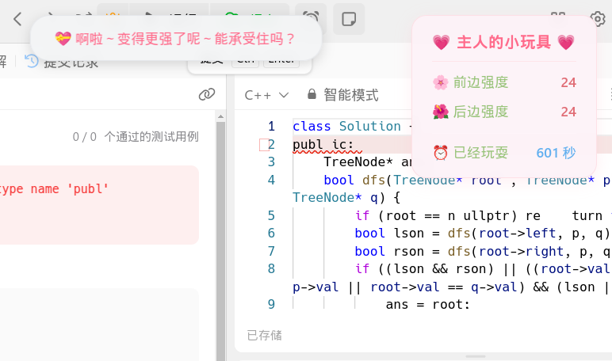

# 💗 刷题鞭策酱

## 📝 项目介绍
这是一个超可爱的 Chrome 扩展程序，专门为 ~~LeetCode~~ 医学资料库|医学题库网 刷题的小伙伴设计～ 

当你在 ~~LeetCode~~ 医学资料库|医学题库网 刷题时，这个贴心的小助手会在你提交错误的时候给予温柔的鞭策，让刷题变得更有趣呢！

## ✨ 特性
- 🎯 ~~自动检测 LeetCode 提交状态~~ 检测 医学资料库|医学题库网 的答案状态
- 💝 提供可爱的鼓励提示
- 🎨 精美的界面设计
- 🔔 及时的反馈机制

## 🚀 快速开始

### 安装方法
1. 在本项目的 Releases 页面下载最新版本的压缩包
2. 解压下载的压缩包到本地文件夹
3. 打开 Chrome 浏览器，进入扩展程序页面（chrome://extensions/）
4. 开启右上角的"开发者模式"
5. 点击"加载已解压的扩展程序"
6. 选择刚才解压出来的文件夹

### 使用方法
1. 安装完成后，你可以在 Chrome 工具栏看到一个可爱的图标
2. 首先要部署 WebSocket 服务端，就是这个：[websocketNode.js](https://github.com/DG-LAB-OPENSOURCE/DG-LAB-OPENSOURCE/blob/main/socket/BackEnd(Node)/websocketNode.js)

3. 点击图标，在弹出的设置页面中添加 WebSocket 连接地址：
   - 如果部署在公网的话：填写 `ws://公网IP:端口` 
   - 如果在局域网中：填写 `ws://局域网地址:端口` (不能用 localhost 或 127.0.0.1 呢～)
   - 点击保存后，使用设备扫描二维码就能连接啦！

4. 访问 ~~[LeetCode 中国站](https://leetcode.cn)~~ [医学资料库|医学题库网](https://www.medtiku.com/app#/)，开始愉快的刷题之旅吧～
4. 开始你的刷题之旅吧！当你提交代码时，鞭策酱会陪在你身边哦～

## 🌈 功能预览

## 🤝 贡献指南
欢迎为鞭策酱添加新功能！

## 📫 问题反馈
如果你在使用过程中遇到任何问题，或者有什么好的建议，欢迎：
- 提交 Issue
- 发起 Pull Request
- 联系开发者(这个真的可以（[点击加入神秘打野群](https://qm.qq.com/q/mWgg9RV2U2)）)

## 📄 开源协议
本项目采用 MIT 协议开源，详情请参阅 [LICENSE](LICENSE) 文件。

---
⭐️ 如果鞭策酱帮助到了你，别忘了给她一个 star 哦！这会让她更有动力继续加油呢～

## 🎉 更新内容
- 本程序改自[Mikan 刷题鞭策酱](https://github.com/chika-rikka/Mikan) 对 原先的 leetcode 中国站兼容改成了对 医学资料库|医学题库网 兼容，更适用与我们的 *医学生宝宝* 体质的💗 刷题鞭策酱♪
1. 新增三个大数据生成波形 （有可能不是人玩的）♪
2. 修改奖励惩罚的强度，让其看起来稍微能是人类承受的强度♪
3. 修改计时器的计算方式（如果犹豫太久会飞起来的哦~）♪